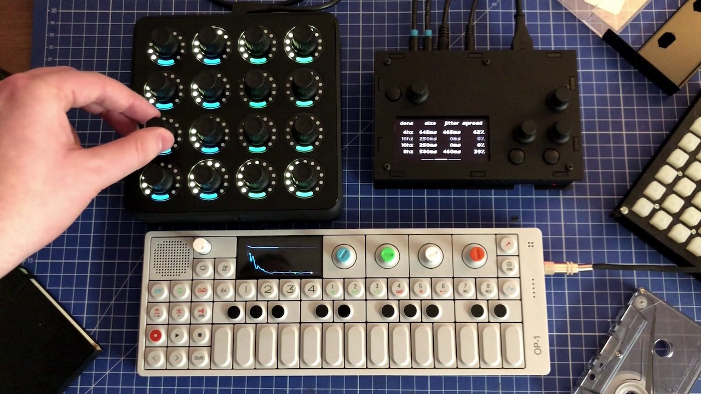
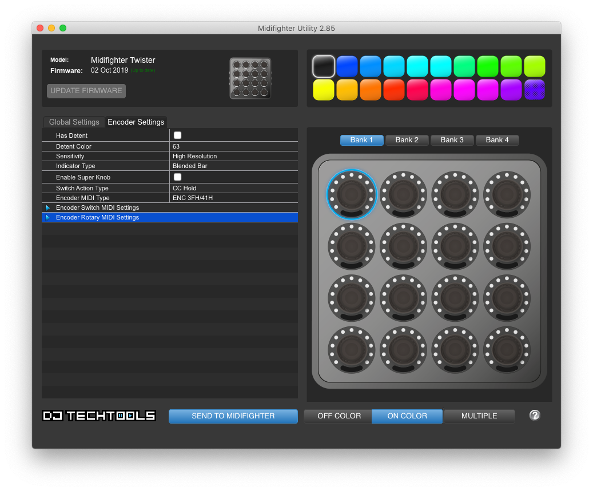

## Haze

Haze is a four track live granular looper for [Norns](https://monome.org/norns/), optimised for Midi Fighter Twister, but also usable without it.

[Check out the video!](https://vimeo.com/513390690)

## Info

The SuperCollider engine is based on [Mangl](https://llllllll.co/t/mangl/21066), which itself is based on [angl](https://llllllll.co/t/ash-a-small-collection/21349) and [glut](https://llllllll.co/t/glut/21175).

Incoming audio is recorded into a subset of four 8-second loops (with configurable feedback), and granular engine samples from these loops.
Each row represents a single track, and there are three banks of parameters, the UI shows currently active bank together with the parameter names and values.

Haze can be used without Midi Fighter Twister through `params` section on Norns, all parameters are MIDI mappable.
To use Haze with Midi Fighter Twister, add it as a Midi device, and start Haze - no MIDI mappings are needed, as everything is handled through the script.

Midi Fighter Twister should be configured with "Midi Fighter Utility" where each encoder has no detent, has black colour, and is configured as `3FH/41H ENC`, below is a screenshot of the configuration of one of the encoders, and you can also download the configuration file [here](./assets/haze-mft-config.mfs).

